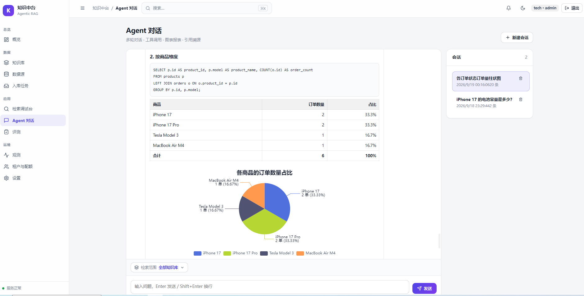

# Agentic RAG 知识中台

> 面向企业的开源知识中台：统一接入多格式文件、多种数据库与多媒体，
> 提供混合检索、多模态检索、Agent 编排、工具治理与全链路观测。

[](LICENSE)
[]()
[]()
[]()



> 在 Agent 对话中提问「各商品的订单数量占比」，小K 自动执行 SQL 查询并渲染 ECharts 饼图。

---

## 特性

**数据接入**
- 多格式文件：md / txt / html / csv / tsv / xlsx / xls / json / pdf / docx / pptx
- 图片：png / jpg / jpeg / bmp / webp / tif（OCR + 可选 VLM 描述）
- 数据库：MySQL / PostgreSQL / SQLite / SQL Server / Oracle / MongoDB
  - 同步模式：表/集合 → 文档 → 向量化（支持增量水位线）
  - 实时模式：Text-to-SQL 只读查询（白名单 + 强制 LIMIT + 超时）
- Web：URL 抓取

**检索**
- 混合检索：向量 + BM25（jieba）并行召回，RRF 融合
- 统一重排：bge-reranker / Qwen3-VL 多模态重排（自动降级）
- 多模态：文本与图片映射到同一向量空间，支持以文搜图、以图搜图
- 图片理解：上传图片提问时由 **Qwen2.5-VL** 视觉模型直接作答（VQA），失败回退 OCR + 文本模型
- 强制租户/数据源/知识库范围过滤（向量与 BM25 均过滤）

**Agent**
- 工具：知识检索、数据源列表、表结构、Text-to-SQL、计算器
- 会话记忆：短期 token 预算裁剪 + 长期 LLM 摘要压缩 + LLM 生成会话标题
- 流式 SSE，回答 Markdown 渲染，支持 ECharts 图表，引用来源带图片缩略图

**平台**
- 多租户隔离、角色权限、配额与限流、凭证加密
- 观测：事件 / 指标 / 告警 / 审计 / 时序图表
- 评测：Hit Rate / MRR，支持范围限定与基线
- 隐私合规：预览与文档接口默认 PII 脱敏

## 技术栈

| 层 | 技术 |
|---|---|
| 前端 | React 18 · TypeScript · Vite · React Router · Zustand · ECharts · react-markdown |
| 后端 | Python 3.12 · FastAPI · Pydantic · Uvicorn |
| RAG 框架 | LlamaIndex（Agent / 切分 / LLM 适配） |
| Embedding | bge-small-zh-v1.5（文本） · Qwen3-VL-Embedding（多模态） |
| 重排 | bge-reranker-base · Qwen3-VL-Reranker（多模态） |
| 富文档 / OCR | PyMuPDF · python-docx · python-pptx · openpyxl · tesseract |
| 向量库 | ChromaDB（cosine HNSW） |
| 存储 | MongoDB · Redis |
| 消息队列 | Kafka（可切换内存 dev 后端） |
| LLM | DeepSeek（OpenAI 兼容接口，可替换） |

## 架构

```
Web 界面 ──REST/SSE──> FastAPI ──> Agent(工具 / 记忆 / 审计)
                                        │
             混合检索(向量 + BM25 + RRF) ──> 重排(CE / VL) ──> 范围过滤
                                        │
        Redis 缓存 + LLM 网关(重试 / 限流 / 熔断 / GPU 锁 / 计量)
                                        │
   Mongo(真相源 / 索引 / 会话 / 审计 / 血缘 / 计量 / 租户) + Chroma(向量)
                                        ▲
   入库流水线(连接器 → 统一模型 → 切分 → 去重 → 批量 Embedding → 版本化)
                                        ▲
   数据接入(文件 / 数据库 / Web) + 富文档 / 多媒体(表格 / OCR / 图片)
```

详见 [docs/ARCHITECTURE.md](docs/ARCHITECTURE.md)。

## 快速开始

### 1. 后端

```bash
cd backend
cp .env.example .env          # 填写 DEEPSEEK_API_KEY 等
pip install -r requirements.txt

# 依赖：MongoDB / Redis；无 Kafka 时设 QUEUE_BACKEND=dev
python scripts/run_api.py            # API 默认 :8000
python scripts/run_consumer.py       # Kafka 消费者（QUEUE_BACKEND=kafka 时）
```

### 2. 前端

```bash
cd frontend
npm install
npm run dev                  # http://localhost:5173，代理到 :8000
# 或 npm run build 后由后端同端口托管
```

### 3. 访问

打开 `http://localhost:5173`（或构建后的后端地址），使用演示账号：

| 账号 | 密码 | 租户 | 角色 |
|---|---|---|---|
| admin | admin123 | tech | 管理员 |
| alice | alice123 | tech | 成员 |
| bob | bob123 | finance | 成员 |

## 使用说明

- **数据源**：新建 → 选择文件目录 / 数据库 / Web → 测试连接 → 同步
- **知识库**：把数据源分组，供 Agent 定向检索（对话页可多选）
- **检索调试台**：文本检索（查看向量/BM25/重排得分）与以图搜图
- **Agent 对话**：多轮问答、工具调用、SQL 查询、图表、引用来源
- **评测 / 观测 / 租户**：指标、基线、审计、配额管理

## 配置要点

| 变量 | 说明 | 默认 |
|---|---|---|
| `EMBED_BACKEND` | `text`（bge 文本）或 `vl`（Qwen3-VL 多模态） | `text` |
| `CHROMA_COLLECTION` | 向量集合名（切换 embedding 时需换新集合） | `agentic_rag_nodes` |
| `RERANK_BACKEND` | `cross_encoder` / `vl` / `llm` / `auto` | `cross_encoder` |
| `QUEUE_BACKEND` | `kafka` / `dev` | `kafka` |
| `PII_MASK_ENABLED` | 预览与文档接口脱敏 | `true` |
| `IMAGE_OCR_ENABLED` / `IMAGE_VLM_ENABLED` | 图片 OCR / VLM 描述 | `true` / `false` |
| `MEMORY_TOKEN_LIMIT` | 会话短期记忆 token 预算 | `10000` |

> 启用多模态（`EMBED_BACKEND=vl`）时使用 Qwen3-VL-Embedding-8B（bf16 约 16GB 显存），
> 建议更换新的 `CHROMA_COLLECTION` 并重新同步数据源。单卡 24G 下同时运行 API 与
> Kafka 消费者会显存不足，此时使用数据源同步入库（API 内完成），消费者可另起一卡或暂不启用。

## 测试

```bash
cd backend
python -m pytest tests/ -q                    # 单元测试

# 端到端（需 API 运行中）
python scripts/06_multiformat_test.py         # 多格式入库 → 检索
python scripts/07_user_journey_test.py        # 用户旅程
```

## 部署

```bash
bash deploy/install.sh
bash deploy/start_all.sh start     # Mongo/Redis/Kafka + API + Consumer
bash deploy/start_all.sh status
```

## 安全与合规

- JWT 鉴权；租户取自 token，检索向量与 BM25 均过滤
- 工具按角色鉴权 + 全量审计
- Text-to-SQL：只读账号 + 语句/表白名单 + 强制 LIMIT + 超时
- 数据源凭证加密存储
- 预览与文档接口默认 PII 脱敏（手机/邮箱/身份证/银行卡/IP/护照 + 列名感知）

## 项目结构

```
backend/   FastAPI 服务（连接器 / 流水线 / 检索 / Agent / 存储 / 观测）
frontend/  Web 界面（React + TS + Vite + ECharts）
deploy/    安装与启动脚本
docs/      架构文档
```

## 许可证

[Apache License 2.0](LICENSE)
