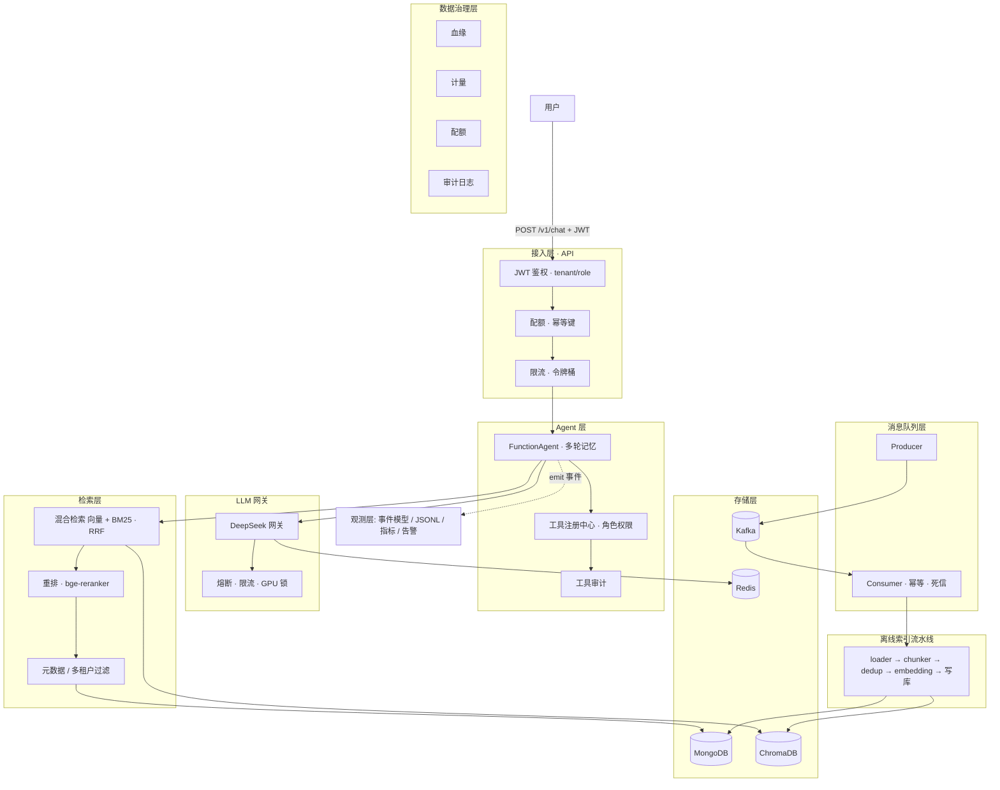

# v2 00 架构总览

> 本节回答：v2 比 v1 多了什么、为什么加、边界在哪。

## 0.1 v1 → v2 演进：一图看懂

```
                        v1（单机可跑教学版）           v2（生产增强版）
API 层      ✗ 只有命令行                        ★ FastAPI + JWT + SSE 流式
队列        ✗ 同步 for 循环                     ★ Kafka(producer/consumer/幂等/死信)
观测        ✗ 打印日志                          ★ 事件模型 + JSONL + 指标 + 告警
网关        ✗ 重试退避                          ★ 限流 + 熔断 + KV前缀统计 + GPU锁
工具        ✗ 裸 FunctionTool                  ★ 注册中心 + 角色权限 + 审计
安全        ✗ 防御性prompt                     ★ JWT鉴权 + 租户配额 + 幂等键
数据治理    ✗ 无                                ★ 审计日志 + 血缘 + 用量计量
评测        ✗ 5题脚本                          ★ 基线 + 回归门禁 + admin报表
```

## 0.2 v2 系统分层架构图（Mermaid）

> 一张图看懂 v2 的分层与数据流。在线链路：用户 → API(鉴权/配额/限流)
> → Agent(工具路由/审计) → 检索/LLM；离线链路：文档 → 队列 → 流水线 → 存储。
> 观测层以事件方式横向贯穿全链路。



## 0.3 为什么 v2 只加"这些"（边界与取舍）

| 没做 | 为什么不做（资源/教学取舍） |
|---|---|
| Mongo 分片 | 单机规模用不到，教学聚焦在"逻辑拆分"而非"物理拆分" |
| 多 Provider | 单一 DeepSeek 够用；网关层留了接口，加 Provider 只是加一条路由 |
| 高可用 | 单机无副本；但"健康检查/优雅停机/熔断"这类**软高可用**已做 |
| 工具沙箱 | 沙箱要进程隔离，太重；用"角色权限 + 审计"守住底线 |
| Vault | 密钥管理用 `.env`（注释里明示生产要换），不引重组件 |
| 换向量库 | Chroma 单机够教学，接口已抽象，换 Milvus 是换实现不是换架构 |

**核心理念**：v2 把 v1 每个"生产上一定会踩"的点，都补上**最小可行**的实现。

## 0.4 v2 新增模块总览

```
agentic_rag_v2/src/
├── api/            FastAPI：/chat(SSE) /documents(队列) /metrics + JWT + 健康检查
├── observability/  事件模型 + JSONL sink + 指标聚合 + 告警规则
├── queue/          Producer/Consumer 抽象 + Kafka实现 + dev内存实现
├── llm/            令牌桶限流 + 熔断器 + GPU单写者锁 + KV前缀统计
├── agent/          工具注册中心(角色权限) + 工具审计
└── storage/        audit(审计) + lineage(血缘) + metering(计量) + quota(配额)
```

## 0.5 一条请求的完整旅程（v2）

```
用户 → POST /v1/chat (带 JWT)
  → ① 鉴权：解析 token → tenant + role
  → ② 配额：今日 token 预算够吗？不够 → 429
  → ③ 限流：租户令牌桶有令牌吗？没有 → 429
  → ④ 建 Agent（system prompt 注入 role/tenant）
  → ⑤ Agent 自主调用工具：
       kb_search → 混合检索(事件:retrieval) → 重排(事件:rerank)
       → 写审计(audit) + 观测事件(tool_call)
  → ⑥ LLM 生成(事件:generate) → 计量token(metering) → 记血缘(lineage)
  → ⑦ SSE 返回 answer + request_id
  → ⑧ 全程事件落 JSONL → admin/report 聚合 → 告警规则检查
```

## 0.6 教程怎么用

```
# 启动全部服务
bash scripts/start_services.sh start

# 冒烟测试（一键验证整条链路）
python scripts/smoke_api.py

# 看指标/告警
python scripts/admin/report.py

# 回归门禁
python scripts/05_eval.py --all --out data/baseline.json
python scripts/admin/check_regression.py --current data/baseline.json
```

> 下一步：[01 API 服务化](01_API服务化.md)
